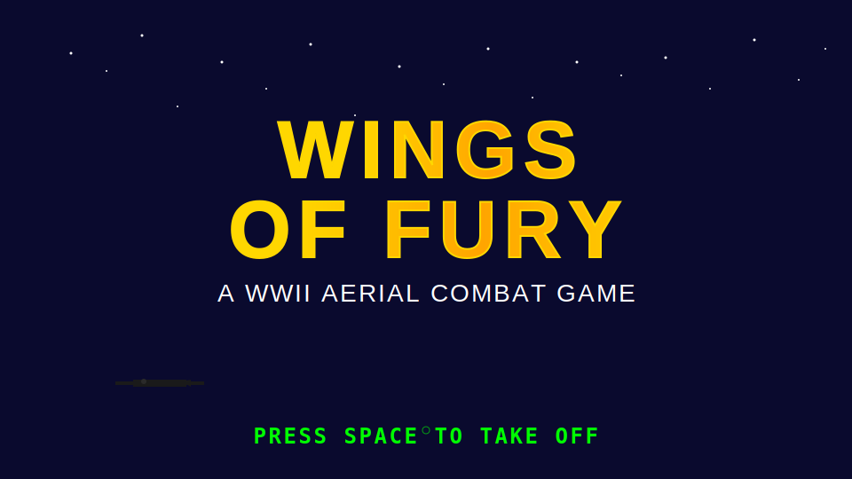
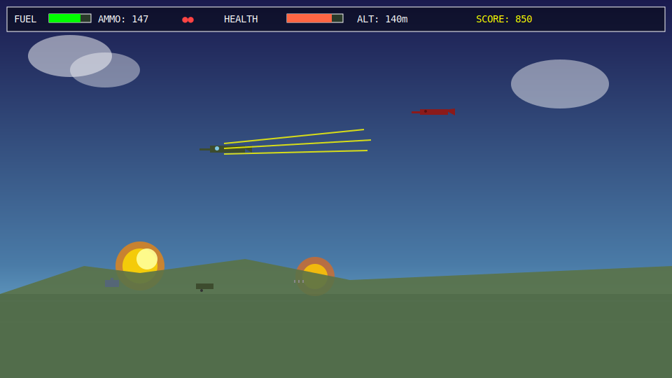
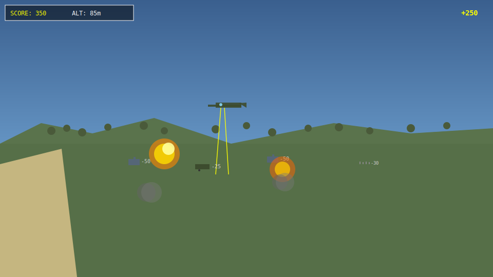
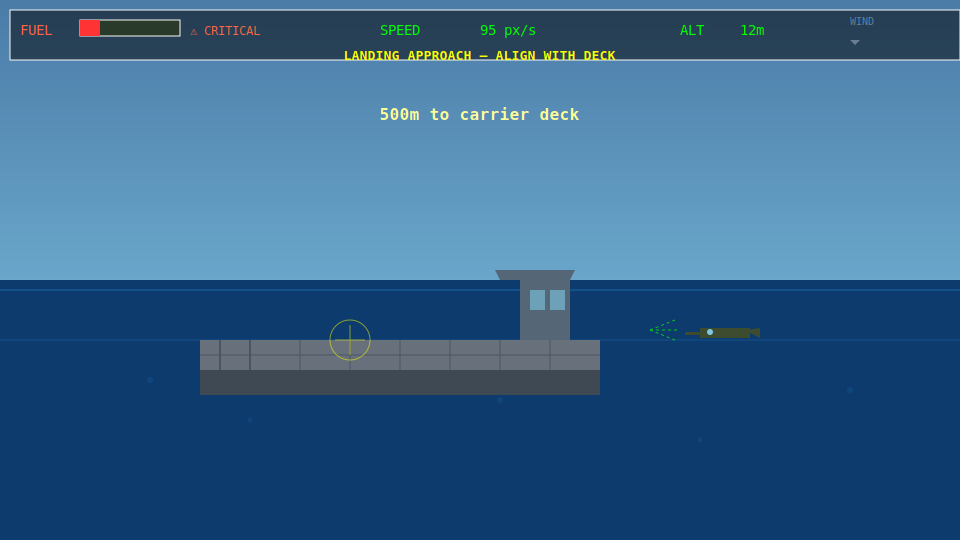

# 🛩️ WINGS OF FURY

**Fire up. Take off. Come back alive.**

<div style="display: grid; grid-template-columns: 1fr 1fr; gap: 20px; margin: 30px 0;">
  
  
  
  
</div>

---

## 🛩️ About the Game

You are a WWII fighter pilot. Your mission is brutal and simple: take off from a carrier, hunt targets across a hostile island, survive, and land back home—all on a single tank of fuel.

**Wings of Fury** captures the raw tension of arcade combat aviation. Feel the weight of every decision: do you push deeper into enemy territory for higher scores, or turn back while fuel still burns in the tank? One perfect strafing run on the island. One fueled dash through anti-aircraft fire. One white-knuckle carrier landing. That's your mission.

Fuel runs out. Enemies don't forgive hesitation. The ocean is patient. Land the plane, rearm, and go again.

---

## ✨ Features

- **Carrier Takeoff & Landing** — Master the procedural challenge of launching from a pitching deck and threading the needle on return
- **200 Rounds of Machine Gun Fire** — Unleash tracer rounds at ground targets and enemy aircraft
- **2 Bombs Per Run** — Rain explosive justice on tanks, trucks, and troops
- **Limited Fuel** — Every second of throttle matters. Turn back too late and you're ditching in the Pacific
- **Dynamic Ground Targets** — Troops, trucks, and tanks with anti-aircraft fire that will shred you if you're careless
- **Enemy Aircraft** — Dogfight surprise visitors while hunting ground targets
- **Scoring System** — Different targets yield different bounties. Play tactical or play reckless
- **Rearming & Refueling** — Land safely to reload and repair—your second run will be better
- **Real Flight Physics** — Speed, angle, gravity, and stall conditions all factor in. Feels like flying, not floaty arcade nonsense
- **Pure JavaScript** — No frameworks, no dependencies. Runs on anything with a browser

---

## 🎮 Controls

| Action | Key |
|--------|-----|
| **Fire Machine Gun** | Space |
| **Drop Bomb** | B |
| **Pitch Up / Down** | Arrow Up / Arrow Down |
| **Bank Left / Right** | Arrow Left / Arrow Right |
| **Throttle Up** | Hold Arrow Left or Right |
| **Throttle Down** | Release both arrow keys |
| **Restart (Game Over)** | R |

---

## 🚀 How to Play

### Option 1: Node.js (Fastest)

```bash
npx serve wings/
```

Then open the displayed URL and navigate to `/wings/` if needed.

### Option 2: Python

```bash
cd wings
python3 -m http.server 8000
```

Open `http://localhost:8000/` in your browser.

### Option 3: Any HTTP Server

Wings of Fury uses ES modules, so it must be served over HTTP (not `file://`). Use your favorite static server to point at the `wings/` directory.

---

## 🎯 Tips & Tricks

1. **Manage Your Fuel** — You spawn with full tanks. Glance at the gauge before every run. A climb costs fuel fast; descending saves it.

2. **Approach the Island Shallow** — Dive too steep and you can't pull up in time. A shallow 20° descent gives you time to line up targets and recover.

3. **Strafe Don't Circle** — The longer you stay over the island, the more enemy fire finds you. Quick passes with the guns blazing are safer than loitering.

4. **Land Gently** — Speed above 100 px/s or a nose-down attitude will shred your landing gear. Kill your throttle 500m out and glide in clean.

5. **Bombs Are Power** — A well-placed bomb clusters multiple targets. Save them for tank formations or the final pass before heading home.

6. **Enemy Planes = Bounty** — Scoring an intercept nets you 100 points, but it pulls you away from the island. Fight only if you have fuel and ammo to burn.

---

## 🏆 Scoring

| Target | Points |
|--------|--------|
| **Troop Squad** | 10 |
| **Truck** | 25 |
| **Tank** | 50 |
| **Enemy Plane** | 100 |

Land safely after destroying all ground targets to trigger **VICTORY** and see your final score.

---

## 🛠️ Technical

**Wings of Fury** is written in **vanilla JavaScript** using ES modules and HTML Canvas. No frameworks, no build step, no dependencies. Everything you see is drawn with Canvas 2D primitives—gradients, paths, and simple shapes.

- **ES Modules** — Clean, modern JavaScript with no bundler required
- **Fixed Timestep** — 60 Hz physics to guarantee smooth, predictable gameplay
- **Single Game Loop** — All input, update, collision, and render logic flows through one central loop
- **Plain Objects** — Entities are simple JS objects with a `type` tag; no OOP overhead

The entire game engine lives in `wings/` as a collection of focused modules. Tweak balance numbers in `constants.js`—no hunting through scattered files.

---

## 📦 Project Structure

```
wings/
├── index.html              # Entry point (canvas element)
├── main.js                 # Game loop & orchestration
├── constants.js            # All tuning numbers
├── state.js                # Game state machine
├── input.js                # Keyboard input handler
├── camera.js               # Viewport & scrolling
├── physics.js              # Flight model
├── collision.js            # Hit detection
├── hud.js                  # HUD rendering
├── audio.js                # Sound effects (procedural)
├── entities/               # Entity modules (player, enemies, etc.)
└── assets/
    └── screenshots/        # Marketing screenshots (SVG)
```

---

## ⚡ Quick Start

```bash
# Serve the game
npx serve wings/

# Then open http://localhost:3000/wings/ in your browser
# Press SPACE to begin
```

---

## 🎓 Development

### Adding Features

1. Add new constants to `constants.js`
2. Create entity modules in `entities/` following the `{ create, update, render }` pattern
3. Wire new entities into `main.js` during the update loop
4. Keep game loop logic in `main.js`; keep entity logic in `entities/`

### Tweaking Balance

All gameplay numbers live in `constants.js`:

```js
export const PLAYER = {
  MAX_SPEED: 350,        // Increase for faster flying
  STALL_SPEED: 85,       // Lower = easier to land
  FUEL_BURN_RATE: 2,     // Increase for shorter missions
  MAX_AMMO: 200,         // More bullets = more forgiveness
  // ... more tuning knobs
};

export const ENEMY = {
  SPAWN_SCORE_STEP: 150, // Enemy spawn frequency
  SCORE_TANK: 50,        // Tank is worth 50 points
  // ... adjust difficulty
};
```

No magic numbers scattered through the code—change one file, change the entire game.

---

## 📝 License

Wings of Fury is a personal project. Play it, fork it, learn from it.

---

**FLIGHT READY. WEAPONS HOT. CLIMB TO 500 FEET AND FORM UP ON ME.**

Press SPACE to take off.
